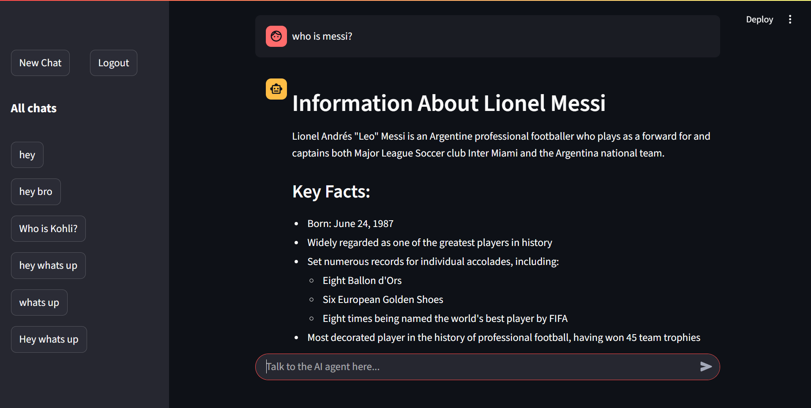
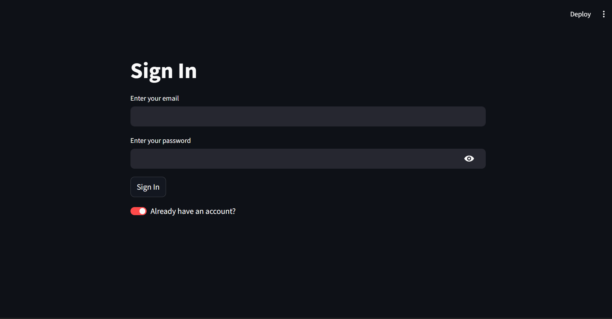
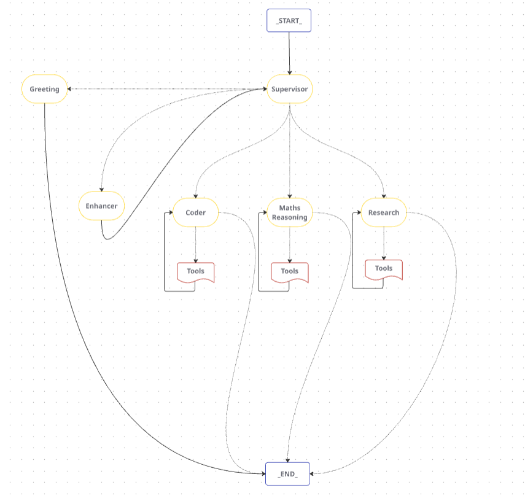
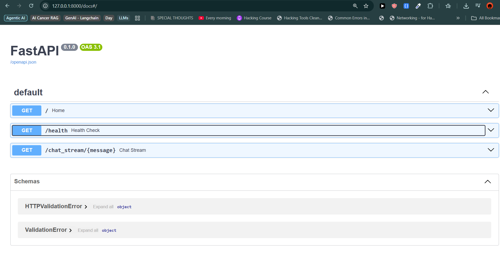
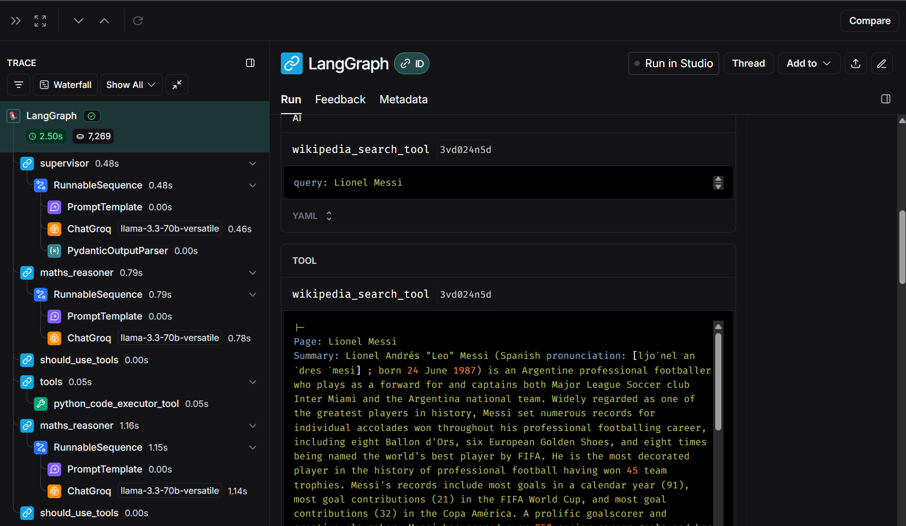

# 🧠 Agentic AI Application — Multi-Agent Supervisor System

A full-stack, modular, agentic AI system powered by LangGraph, LangChain, and multiple external tools. Built to handle intelligent task decomposition, multi-step reasoning, and user-friendly interaction.


### 📸 Preview

| Chatbot UI (1) | Chatbot UI (2) |
|---|---|
|  |  |


| User Auth | Workflow |
|---|---|
|  |  |

| FastAPI | LangSmith |
|---|---|
|  |  |

---


## 🧩 Architecture Overview

```
                      ┌────────────┐
                      │ Supervisor │
                      └─────┬──────┘
                            ↓
        ┌──────────┬──────────────┬─────────────┬───────────────┐
        ↓          ↓              ↓             ↓               ↓
    Greeting    Enhancer       Coder     Maths Reasoner     Researcher
        │          │              │             │               │
        └──────────┴────┬─────────┴─────────────┴───────────────┘
                        ↓
                 Tool Execution Layer
            (Python REPL, Tavily, PubMed, etc.)
```

---


## 🛠️ Tech Stack

| Layer              | Tools/Frameworks                          |
| ------------------ | ----------------------------------------- |
| **Agents & Logic** | `LangChain`, `LangGraph`                  |
| **Backend**        | `FastAPI`, `Supabase` (Auth & DB)         |
| **Frontend**       | `Streamlit` with real-time chat streaming |
| **DevOps**         | `Docker`, `GitHub`, `Langsmith`           |


---


## 🧠 Agents & Tools

### 👷 Supervisor Agent

- Central brain of the system
    
- Delegates tasks to other agents
    
- Makes decisions based on outputs and history
    

### ✨ Enhancer Agent

- Improves clarity, tone, and relevance of intermediate results
    

### 💬 Greeting Agent

- Handles user onboarding and initial context setting
    

### 🧑‍💻 Coder Agent

- Writes and debugs code
    
- Uses `PythonREPL` for live execution
    

### 🧠 Maths Reasoner

- Handles symbolic & numerical problems
    
- Uses `calculator` and `PythonREPL`
    

### 🔍 Researcher

- Finds factual data and references using:
    
    - `Tavily`
        
    - `DuckDuckGo`
        
    - `Wikipedia`
        
    - `PubMed`

---


## 💡 Features

✅ Real-time **streaming chatbot interface**  
✅ **Multi-session / Multi-chat** support  
✅ **User authentication** via Supabase  
✅ Modular **agent-tool orchestration**  
✅ **LangSmith** monitoring and observability  
✅ **Dynamic memory** per chat  
✅ Fully **containerized** with Docker  
✅ Ready for **deployment** on Render etc.


---


## 🧰 Setup Instructions

### 1. Clone Repo

```
git clone https://github.com/ayushWeb07/supervisor-multi-agent-app.git
cd supervisor-multi-agent-app
```


### 2. Environment Setup

Create `.env` file:

```
TAVILY_API_KEY=...
LANGSMITH_TRACING=...
LANGSMITH_ENDPOINT=...
LANGSMITH_API_KEY=...
LANGSMITH_PROJECT=...
OPENAI_API_KEY=...
GROQ_API_KEY=...
SUPABASE_URL=...
SUPABASE_KEY=...
```

### 3. Run Locally


```
# Backend
uvicorn backend.fastapi_backend:app --reload

# Frontend
streamlit run .\frontend\streamlit_frontend.py
```

---


## 🧪 Tooling Integration

|Tool|Purpose|
|---|---|
|**Tavily**|Fast multi-source web search|
|**Wikipedia**|Structured encyclopedic info|
|**DuckDuckGo**|Lightweight search fallback|
|**PubMed**|Scientific paper lookup|
|**PythonREPL**|Code execution sandbox|
|**Calculator**|Basic arithmetic + formulas|

---

## 🔗 Links:
[🎥 Full App Demo](https://youtu.be/4gy9xeHbfkc)
[📖 Medium Blog](https://medium.com/@ayushbommana/building-a-supervisor-based-multi-agent-chatbot-system-ce4513872cee)
[👨‍💼 LinkedIn Post](https://www.linkedin.com/feed/update/urn:li:activity:7347713877263994880/)


## 🤝 Contributing

PRs welcome! If you're into agentic systems, AI agents, and RAG pipelines, feel free to fork, tinker, and improve.
